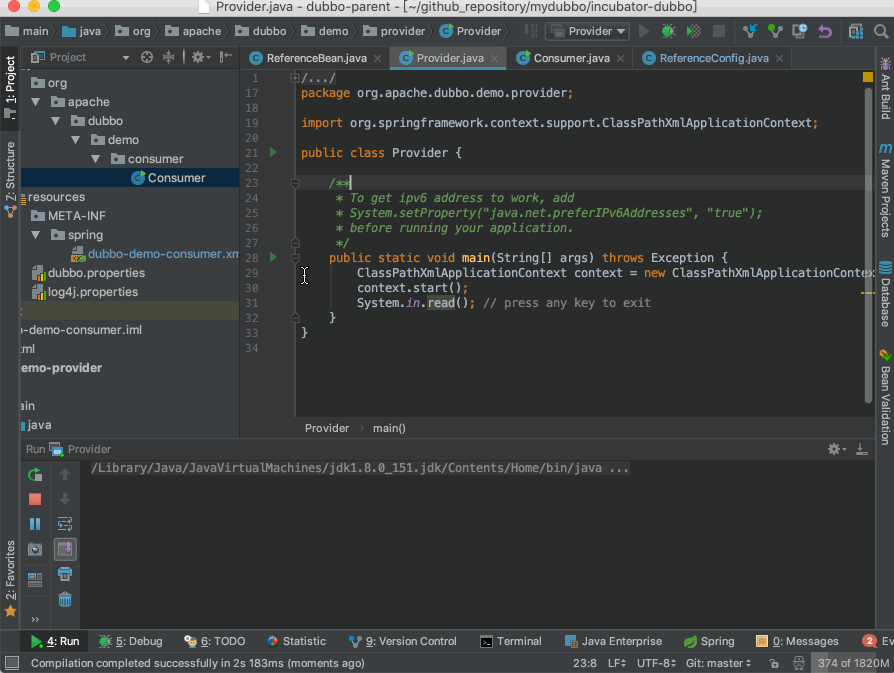
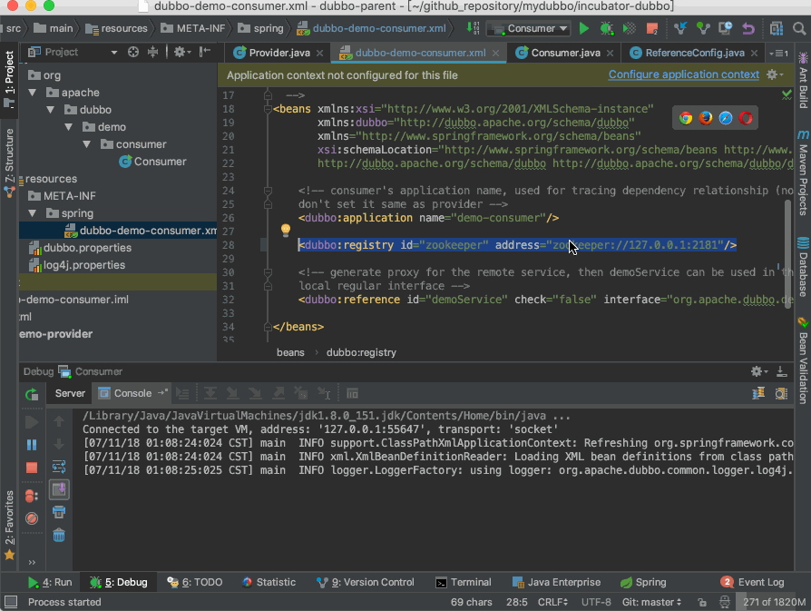
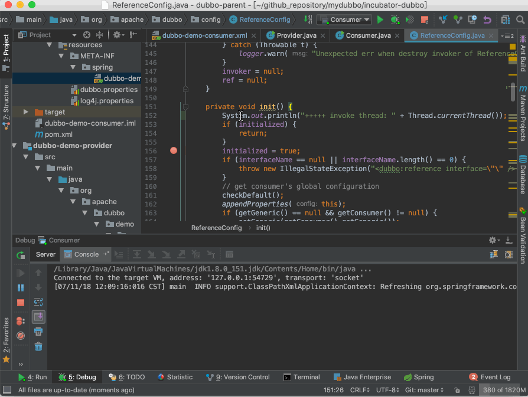
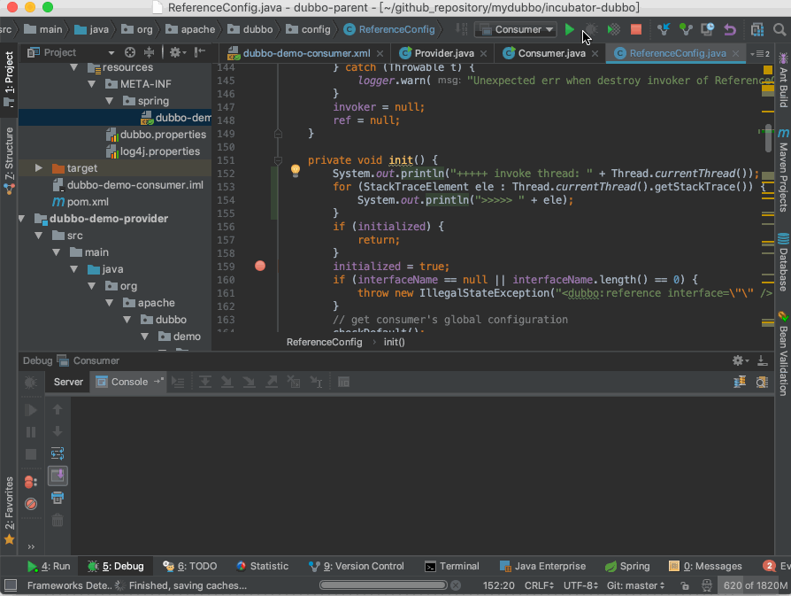
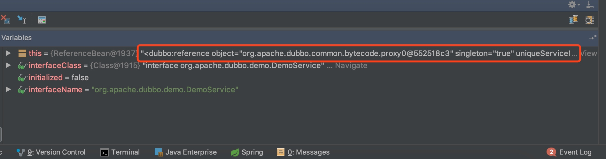
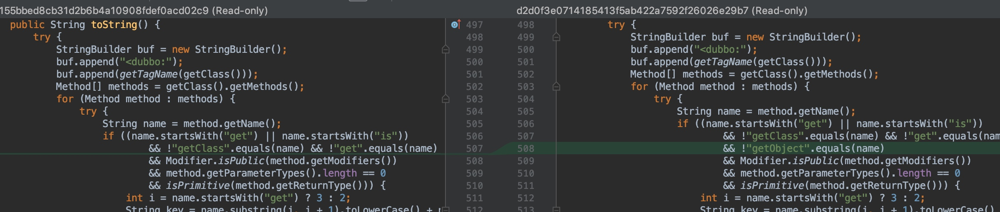

# Dubbo 服务二次引用问题报告

## 1.背景

我在调试服务引用相关代码时，遇到了两个奇怪的问题。第一个是我从 ReferenceBean 的 getObject 方法开始调试，当我调试到 ReferenceConfig 的 get 方法时，发现 ref 变量不为空，所以就无法进入 init 方法中继续调试。调试过程如下：



既然无法进入 init 方法中，那么我直接在 init 方法中下断点好了，反正 init 方法总是会被调用的。当线程进入 init 方法中后，继续向下调试，又有奇怪的事情发生了。我只配置了一个注册中心，但在 ReferenceConfig 的 urls 列表中却出现了两条一样的注册中心地址，演示过程如下：



如上，urls 列表中出现了两个完全相等的链接。难道 Dubbo 初始化过程中会将注册中心地址添加到 ReferenceConfig 的 urls 列表中？于是我把调用 urls.add 方法的逻辑都看了一遍，排除了这个可能。这个问题倒不影响我学习 Dubbo 源码，但是这是一个很奇怪的问题，不找出原因很难受。于是我进行了将近两个小时的调试，终于找出了问题所在。

## 2.复现步骤

对于第一个问题，复现步骤如下：

1. 在 ReferenceBean 的 getObject 方法体内打断点
2. 以调试模式启动 Consumer Demo
3. 在断点处进行单步调试，进入到 get 方法中，继续向下调试就会发现问题

对于第二个问题，复现步骤如下：

1. 取消之前在 getObject 中下的断点，并将断点位置设在 ReferenceConfig init 方法中，位置为 155 行（initialized = true;）
2. 调试代码至 ReferenceConfig 的 344 行（List\<URL\> us = loadRegistries(false)），然后单步调试，此时注意观察 ReferenceConfig 的 urls 集合的内容变化。

## 3.问题排查过程

期初我以为 Spring 在加载完 Dubbo 的某些类时，Dubbo 启动了背景线程。可是我把几个要加载类的代码看了一遍，包括 Dubbo 配置解析类，没发现有启动背景线程的逻辑。但是这种情况看起来还是像有背景线程在运行，为了验证是不是有背景线程在运行，于是我把 init 方法的调用线程信息打印了出来。如下：



从结果可以看出，并没有背景线程，只有主线程在运行。奇怪的是，主线程已经被断点断下了，为什么还会再次调用 init 方法呢。百思不得解，为了收集更多的信息，于是把线程的调用栈打印了出来，通过调用栈看看线程执行过程是怎样的。




这次有了意外的收获了，调用栈中出现了一个奇怪的调用，即 AbstractConfig 的 toString 方法。这里先把完整的调用栈信息贴在下面：

```java
org.apache.dubbo.config.ReferenceConfig.init(ReferenceConfig.java:153)
org.apache.dubbo.config.ReferenceConfig.get(ReferenceConfig.java:129)
org.apache.dubbo.config.spring.ReferenceBean.getObject(ReferenceBean.java:64)
sun.reflect.NativeMethodAccessorImpl.invoke0(Native Method)
sun.reflect.NativeMethodAccessorImpl.invoke(NativeMethodAccessorImpl.java:62)
sun.reflect.DelegatingMethodAccessorImpl.invoke(DelegatingMethodAccessorImpl.java:43)
java.lang.reflect.Method.invoke(Method.java:498)
>>> org.apache.dubbo.config.AbstractConfig.toString(AbstractConfig.java:513)
org.apache.dubbo.config.ReferenceConfig.init(ReferenceConfig.java:159)
org.apache.dubbo.config.ReferenceConfig.get(ReferenceConfig.java:129)
org.apache.dubbo.config.spring.ReferenceBean.getObject(ReferenceBean.java:64)
org.springframework.beans.factory.support.FactoryBeanRegistrySupport.doGetObjectFromFactoryBean(FactoryBeanRegistrySupport.java:170)
org.springframework.beans.factory.support.FactoryBeanRegistrySupport.getObjectFromFactoryBean(FactoryBeanRegistrySupport.java:103)
org.springframework.beans.factory.support.AbstractBeanFactory.getObjectForBeanInstance(AbstractBeanFactory.java:1640)
org.springframework.beans.factory.support.AbstractBeanFactory.doGetBean(AbstractBeanFactory.java:254)
org.springframework.beans.factory.support.AbstractBeanFactory.getBean(AbstractBeanFactory.java:197)
org.springframework.context.support.AbstractApplicationContext.getBean(AbstractApplicationContext.java:1080)
org.apache.dubbo.demo.consumer.Consumer.main(Consumer.java:32)
```

AbstractConfig 类的 toString 方法在 513 行通过反射调用了 ReferenceBean 的 getObject 方法，促使二次引用服务动作，导致了一些令人困惑的问题。那么谁会调用 AbstractConfig 类的 toString 方法呢？首先框架本身肯定没必要调用，然后我所使用测试代码也没调用。同时通过前面的验证，可以断定这里也不会有背景线程调用。问题到这里似乎陷入了僵局。更奇怪的是，如果我们在 toString 中下断点，会发现 IDE 无法在断点处暂停，也就无法进行调试。对于种种奇怪的事情，经过深思熟虑，还是没找出原因所在。这个时候，我瞄了一眼调试器的变量窗口，发现了一些端倪。



红框中的信息是哪来的？应该是通过 AbstractConfig 类的 toString 方法得来的。真相大白了，IDE 调试器为了显示对象的信息，会通过 toString 方法获取对象对应的信息。这也就解释了 toString 方法会出现在调用栈中，以及 IDE 为什么无法在 toString 中的断点位置中断线程。AbstractConfig 的 toString 方法逻辑本身不复杂，该方法通过反射获取 ReferenceBean 的所有 getter 方法，然后通过 getter 方法获取属性值。这样做本身没什么问题，但是该方法恰巧忽略了 getObject 这个方法，最终导致该方法被意外调用。这也就解释了为什么从 getOject 处进行调试，无法进入 init 方法的原因。以及为什么 ReferenceConfig 的 urls 列表中会出现两条一模一样的链接。原来是 IDE 在背后搞的鬼，不过 IDE 肯定不愿意背这个锅。说起来，应该是框架本身有点小问题，IDE 不小心触发了这个问题，然后它们联合起来幽默了一把。

## 4.解决办法

在 toString 遍历 Method 数组时增加一个条件判断，过滤掉 getObject 方法。Like this:



